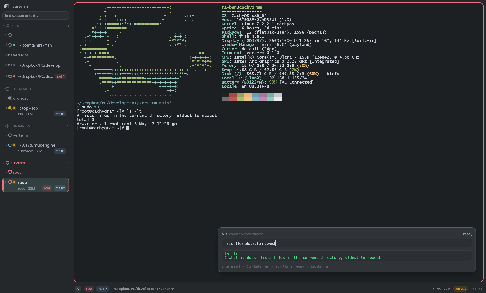

# verterm



A GPU-accelerated, keyboard-centric terminal emulator for Linux with a **vertical tab tree**, `/proc`-driven
**session classification** (local project · SSH host · root), dense **job-health indicators**, native
**desktop notifications** when long commands finish unfocused, and a **summon-only local AI** command
generator (Ollama). Written in Rust 2024 on `alacritty_terminal` + `egui`/`wgpu`; Wayland (Niri) first.

## Build & install
```sh
./install.sh                        # cargo build --release, strip, -> ~/.local/bin/verterm + .desktop
./install.sh --no-build             # install an already-built release binary
PREFIX=~/opt ./install.sh           # install somewhere else
```

`eframe` 0.36.1 is vendored under `vendor/` with upstream [emilk/egui#8398](https://github.com/emilk/egui/pull/8398) backported (a hidden window on Wayland otherwise spins one CPU core at 100%); the patch goes away once eframe 0.37 is released — see `vendor/README.md`.

Installs per-user; no sudo and no system paths. Nothing needs installing beside the binary — the
shell-integration scripts are embedded and written to `$XDG_DATA_HOME/verterm/shell-integration` on first
run. If `~/.local/bin` is not on your `PATH`, add it.

To build without installing, note that this checkout redirects Cargo's `target-dir` (see
`.cargo/config.toml`), so the binary is **not** under `./target`:
```sh
cargo build --release
"$(cargo metadata --format-version 1 | python3 -c 'import sys,json;print(json.load(sys.stdin)["target_directory"])')"/release/verterm
```

## Run
```sh
verterm -d ~/src                    # start in a directory
verterm -e htop                     # run a program instead of the shell
verterm --print-default-config > ~/.config/verterm/config.toml
```
Requires a Wayland (or X11) session with Vulkan drivers, fontconfig (`fc-match`) and a notification daemon
(mako / dunst / swaync) for desktop alerts. A Nerd Font is recommended (`[font].family`).

## What you get
- **Tab rail** (`Alt+\`): buckets `LOCAL` (grouped by project root: `.git`, `Cargo.toml`, `go.mod`, …),
  `SSH / REMOTE` (grouped by host), `CONTAINERS` (grouped by container name — `distrobox enter`,
  `docker`/`podman exec`, `toolbox`), `ELEVATED` (sudo/doas/root shells, red perimeter), `AD-HOC` (scratchpads
  that close when their command exits). Groups fold; tabs can be pinned to another group.
  Each bucket is a bounded, rounded panel with its category capping the top, and every group inside
  it gets its own hue — a tinted band, a coloured spine down its tabs, and a matching header — so a
  session is found by aiming at a coloured region instead of reading every row. A group keeps its
  hue across restarts, and two groups that touch never share one.
- **Indicators per tab**: `·` idle, `◦/●` amber (pulsing after 3 s) running, `●` green exit 0, `●` red + code
  on failure; badges `[SSH: host]` `[ROOT]` `[GIT: branch*]`; footprint `nvim (42M)` / `make (8 cores, 94%, 1.2G)`.
- **Notifications** over D-Bus when a command that ran ≥ 3 s finishes while the tab/window is unfocused
  (`build finished in 4m 12s` / `failed after 3.2s (SIGKILL / OOM-killed)`), and on bell — a bell
  notification names the job that rang, how long it has been running, the directory, remote host or
  root elevation, and the tab index plus shell pid, rather than a generic message. Every notification
  carries a **Show session** button (and clicking the body does the same) that switches verterm to the
  tab it came from — so returning to a finished build lands you on it.
- **Shell integration** (bash/zsh/fish, injected automatically) emits OSC 7 (cwd) and OSC 133
  (prompt/command boundaries + exit codes). Without it, running/finished is inferred from `/proc`; exit codes
  are then unknown.
- **Vi mode** (`Ctrl+[`): navigate scrollback, `/` `?` search, `v` `V` `Ctrl+V` select, `y` yank.
- **Find a session** (`Alt+F`): a box at the top of the rail. Type what identifies the session — its
  name, directory, ssh host, container, git branch, program, or its `Alt+N` number — and results appear
  under **SESSIONS**. Anything three characters or longer is *also* looked for in every tab's scrollback,
  listed under **CONTAINS TEXT** with the matching line, so `rapl` finds the tab that printed it.
  `↑`/`↓` select, `Enter` switches to it, `Esc` clears then closes.
- **Fast jump** (`Alt+U` / `Super+F`): URLs, paths, IPs, UUIDs and git hashes get home-row tags; lowercase copies,
  uppercase opens (URL) or pastes (path).
- **AI prompt** (`Ctrl+Space` / `Super+K`): describe a command in English; the reply streams into an overlay
  above the prompt. `Enter` inserts it into the prompt (bracketed paste, not executed), `Ctrl+Enter` runs it,
  `Esc` dismisses. Nothing reaches the shell without your keystroke. The model's `# what it does`
  note rides on the end of the command's own line, so the shell has no continuation line to indent.
  The request carries what the model needs to answer for *this* shell: the shell's own aliases and
  abbreviations (probed once per shell, local tabs only), the previous command with its exit code and a short
  excerpt of its output, and — when you had text selected — that selection, which `Ctrl+S` toggles off.
  After a suggestion you ran fails, `Ctrl+R` re-asks the same question with the failure attached.
- **Command palette** (`Ctrl+Shift+P`), scratchpad prompt (`Ctrl+Shift+E`), font zoom, status bar.

## Default keybindings
| Chord | Action | Chord | Action |
|---|---|---|---|
| `Alt+\` | toggle tab rail | `Ctrl+[` | vi / scrollback mode |
| `Alt+J` / `Alt+K` | next / previous tab | `Ctrl+Shift+F` | search scrollback |
| `Alt+1`…`Alt+9` | select tab N | `Alt+U`, `Super+F` | fast-jump hints |
| `Alt+Shift+J` / `Alt+Shift+K` | move tab to next / previous group | `Ctrl+Space`, `Super+K` | AI command prompt |
| `Alt+G` | fold / unfold current group | `Ctrl+Shift+T` / `Ctrl+Shift+W` | new / close tab |
| `Alt+H` / `Alt+L` | collapse (twice: bucket) / expand | `Ctrl+Shift+E` | new scratchpad tab |
| `Alt+F` | find a session (name, cwd, host, or its output) | | |
| `Shift+PageUp/PageDown/End` | scroll | `Ctrl+Shift+P` | command palette |
| `Ctrl+Shift+C` / `Ctrl+Shift+V` | copy / paste (fixed) | `Ctrl+Shift+=` / `-` / `0` | font size |

Rebind anything in `[keys]` (`action = "Ctrl+Shift+T"`, `action_alt = …` for a second chord). Vi mode keys:
`h j k l w b e W B E 0 $ ^ H M L % { } g G`, `Ctrl+B/F/U/D/Y/E`, `v V Ctrl+V`, `y`/Enter, `/ ? n N`, `Esc`, `i`/`q`.
Mouse still works for selection (double = word, triple = line), wheel scrolling and clicking rail rows
— it is never required. Right-click opens a context menu: on the grid, copy/paste plus the URL or path
under the pointer (open or copy it without entering hint mode), select all, search, hints, Ask AI, a new
tab in the same directory, clear scrollback and close tab; on a tab row, activate, copy the working
directory, move between groups, new tab and close tab; on empty rail space, new tab/scratchpad and
collapse or expand all groups. Middle-clicking a tab closes it; double-clicking empty space on the tab
rail opens a new tab.

## Configuration
`$XDG_CONFIG_HOME/verterm/config.toml` (all keys optional; see `config.example.toml`):

| Section | Keys |
|---|---|
| `[general]` | `shell`, `scrollback`, `rail_side`, `rail_width`, `rail_visible`, `show_icon`, `shell_integration`, `status_bar`, `cursor_blink`, `term`, `close_on_exit`, `scan_interval_ms` |
| `[font]` | `family` (list, first fontconfig match wins), `ui_family` (proportional face for the chrome), `size`, `line_height` |
| `[ai]` | `enabled`, `endpoint` (`https://orohost:11434`), `model`, `stream`, `temperature`, `insecure_tls`, `timeout_secs`, `context_lines`, `position` (`bottom-right` \| `bottom-left` \| `top-right` \| `top-left` \| `center` \| `prompt`), `system_prompt` |
| `[notifications]` | `enabled`, `threshold_secs`, `on_bell`, `timeout_ms` |
| `[colors]` | `theme` (built-in scheme, see below), plus optional per-key overrides: `foreground`, `background`, `cursor`, `selection`, `accent` (chrome accent), `normal[8]`, `bright[8]` |
| `[keys]` | `action = "Chord"` |

### Themes
`theme = "<name>"` under `[colors]` restyles the **whole client**, not just the grid: the rail's
surfaces, borders, badges, gauges and per-group bands are all derived from the scheme's sixteen ANSI
colours, and a light background flips the chrome to a light treatment on its own.

| | |
|---|---|
| dark | `verterm-dark` (default), `catppuccin-mocha`, `tokyo-night`, `dracula`, `nord`, `gruvbox-dark`, `one-dark`, `solarized-dark` |
| light | `catppuccin-latte`, `tokyo-night-day`, `solarized-light`, `gruvbox-light`, `one-light`, `github-light`, `everforest-light` |

`verterm --list-themes` prints them; `verterm --theme <name>` overrides the config for one run. Any
`[colors]` key you set wins over the theme, so a scheme is a starting point rather than a lock-in —
and setting `background` alone is enough to take a dark theme light, because the chrome measures
which it is rather than trusting the name.

The config file is hot-reloaded: saving it applies theme/font-family/keybinding/AI-client changes
immediately (a toast confirms it). A file watcher reacts right away, with a polling fallback in
case the watcher can't start; either way a reload lands within a couple of seconds. `scan_interval_ms`
and `shell_integration` are read once at startup and need a restart. Rail visibility and zoom level are
runtime state and are not reset by a reload.

## Notes
- Elevated shells started with `sudo -i` do not inherit shell integration; source
  `$VERTERM_SHELL_INTEGRATION_DIR/verterm.bash` (or `.zsh`) from root's rc if you want exit codes there.
- `Ctrl+[` is the spec'd vi-mode chord; it is the same byte as `Esc` in a terminal, so if you rely on `Ctrl+[`
  inside vim, rebind `vi_mode` (e.g. `"Ctrl+Shift+Space"`).
- Run with `RUST_LOG=verterm=debug` to see startup diagnostics (font resolution, shell integration path, AI errors).

## Development
The architecture map and the subsystem routing table live in `CLAUDE.md` and `.claude/skills/`, which are
working notes kept out of the repository (see `.gitignore`) — they ship with a checkout, not a clone. `cargo test`
covers the pure-logic modules (OSC tap, hints, keymap, input encoding, tab tree, AI extraction, ssh parsing).
